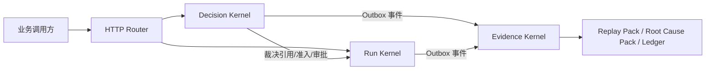

# Agent Infra System

[](https://github.com/wandering-the-earth/agent_infra_system/actions/workflows/ci.yml)
[](https://github.com/wandering-the-earth/agent_infra_system/actions/workflows/release.yml)
[](https://go.dev/)
[](./LICENSE)

企业级 Agent 基础设施系统，采用三内核运行模型：

- Decision Kernel：策略裁决与安全约束
- Run Kernel：运行状态机与执行门禁
- Evidence Kernel：证据归档、回放与审计追踪

---

## 中文说明

## 1. 项目定位

本项目不是“聊天机器人应用”，而是面向生产环境的 Agent 运行底座。核心目标是：

1. 让决策可控（先裁决，后执行）
2. 让执行可靠（状态一致、资源可证、幂等可追踪）
3. 让过程可审计（可解释、可回放、可对账）

## 2. 解决的问题

典型 Agent 系统在生产中常见三类问题：

1. 决策不确定：模型输出被直接当成执行许可
2. 运行不稳定：重试、回调、长等待导致状态漂移
3. 证据不完整：事故发生后无法还原“为什么这样执行”

本项目通过内核分层、双确认机制、票据治理和证据链，系统性解决上述问题。

## 3. 架构概览



## 4. 核心原则

1. 决策先于执行
2. 副作用执行必须经过双确认
3. run/step/attempt/phase 必须稳定绑定
4. 资源使用必须经过 ticket + receipt 双层约束
5. 证据不是普通日志，必须可验证、可回放
6. 高风险路径默认保守（review/fail-closed）

## 5. 三内核能力矩阵

| 内核 | 核心职责 | 典型接口 | 关键保证 |
|---|---|---|---|
| Decision | 运行时裁决、调度准入、审批、obligations | `/v1/decision/*` `/v1/approval/*` `/v1/features/*` | 策略可控、预算门禁、裁决可解释 |
| Run | 生命周期状态机、step 推进、幂等与 continuation | `/v1/runs/*` | 单调推进、执行前硬门禁、活性保障 |
| Evidence | 证据事件标准化、图谱、账本、回放工件 | `/v1/evidence/*` `/v1/ledger/*` | 可审计、可追溯、可复盘 |

## 6. 端到端执行链路

一次标准执行链路如下：

1. `POST /v1/runs` 创建 run
2. `POST /v1/decision/evaluate-runtime` 做运行时裁决
3. `POST /v1/decision/confirm-run-advance` 做双确认
4. `POST /v1/decision/evaluate-schedule-admission` 获取调度票据
5. `POST /v1/runs/{run_id}/advance` 推进执行（含票据/约束校验）
6. 如需人工审批：`/v1/approval/cases*`
7. 通过 `/v1/evidence/*` 查询证据、回放包、根因包

## 7. 快速开始

### 7.1 环境要求

- Go `1.26+`

### 7.2 启动服务

```bash
go run ./cmd/agent-infra
```

默认监听 `:8080`，可通过 `AGENT_INFRA_ADDR` 覆盖。

### 7.3 运行测试

```bash
go test ./... -count=1
```

## 8. CI / Release 流程

### CI

文件：`/.github/workflows/ci.yml`

- 触发：`master/main` 分支 push 与 PR
- 步骤：`gofmt` -> `go vet` -> `go test` -> 覆盖率门禁

### Release

文件：`/.github/workflows/release.yml`

- 触发：tag push（如 `v0.1.0`）
- 行为：测试校验 -> 多平台构建 -> 打包校验和 -> 发布 GitHub Release

发布示例：

```bash
git tag v0.1.0
git push origin v0.1.0
```

## 9. 目录结构

```text
agent/
  cmd/agent-infra/                  # 进程入口
  internal/decision/                # Decision Kernel
  internal/run/                     # Run Kernel
  internal/evidence/                # Evidence Kernel
  internal/httpapi/                 # HTTP 适配与内核编排
  testdata/                         # 测试样例
  doc/
    design/                         # 架构与设计主规范
    specs/                          # 执行级规范（policy/eval/skills）
    guides/                         # 项目说明与工程导读
    governance/                     # 团队治理与流程守则
```

## 10. 文档入口

- 架构主规范：[Agent系统设计-主文档.md](./doc/design/Agent系统设计-主文档.md)
- 精简落地方案：[Agent-Infra-精简化落地方案-全问题覆盖.md](./doc/design/Agent-Infra-精简化落地方案-全问题覆盖.md)
- 项目说明（原理版）：[Agent-Infra-项目说明-全流程原理与运行机制.md](./doc/guides/Agent-Infra-项目说明-全流程原理与运行机制.md)
- 工程代码导读：[工程代码导读-从零到跑通.md](./doc/guides/工程代码导读-从零到跑通.md)
- 文档索引：[doc/README.md](./doc/README.md)

## 11. 许可证

本项目采用 Apache License 2.0。

详见 [LICENSE](./LICENSE) 与 [NOTICE](./NOTICE)。

---

## English Snapshot

Agent Infra System is a production-oriented agent runtime foundation with three kernels:

- Decision Kernel: policy-driven decisions, approval, admission, and constraints
- Run Kernel: deterministic run progression, idempotency, and execution gating
- Evidence Kernel: canonical evidence events, replay packs, root-cause packs, and audit trails

Quick start:

```bash
go run ./cmd/agent-infra
go test ./... -count=1
```

Release by tag:

```bash
git tag v0.1.0
git push origin v0.1.0
```
