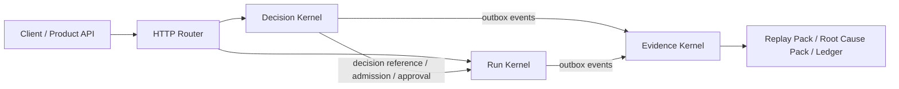

# Agent Infra System

[](https://github.com/wandering-the-earth/agent_infra_system/actions/workflows/ci.yml)
[](https://github.com/wandering-the-earth/agent_infra_system/actions/workflows/release.yml)
[](https://go.dev/)
[](./LICENSE)

Enterprise-grade Agent infrastructure with a tri-kernel runtime model:

- Decision Kernel: policy-driven decisioning and safety constraints
- Run Kernel: deterministic run-state progression and execution gating
- Evidence Kernel: auditable event canon, replay, and root-cause artifacts

---

## What This Project Solves

Modern Agent systems usually fail in three places:

1. Decision uncertainty: model output is treated as execution permission
2. Runtime drift: retries, callbacks, and long waits cause state inconsistency
3. Audit gaps: incidents cannot be reconstructed with deterministic evidence

This project addresses all three with explicit runtime contracts, cross-kernel verification, and evidence-first operations.

---

## Architecture At a Glance



---

## Core Design Principles

1. Decide first, execute second
2. Two-phase confirmation before side effects
3. Stable binding for run/step/attempt/phase ownership
4. Ticket + receipt resource governance
5. Evidence is not logs; evidence is verifiable runtime truth
6. Fail-safe posture for high-risk paths (fail-closed / review-required)

---

## Kernel Capability Matrix

| Kernel | Responsibility | Typical APIs | Hard Guarantees |
|---|---|---|---|
| Decision | Runtime decisioning, admission, approval, obligations | `/v1/decision/*`, `/v1/approval/*`, `/v1/features/*` | policy-bound outcomes, budget guards, confirmation semantics |
| Run | Run lifecycle, step progression, idempotency, continuations | `/v1/runs/*` | monotonic progress, state transition controls, execution gates |
| Evidence | Event canon, decision graph, ledger, replay, integrity | `/v1/evidence/*`, `/v1/ledger/*` | replay-ready artifacts, integrity verification, retention controls |

---

## End-to-End Execution Contract

A typical run follows this sequence:

1. Create run context (`POST /v1/runs`)
2. Evaluate runtime decision (`POST /v1/decision/evaluate-runtime`)
3. Confirm run-advance eligibility (`POST /v1/decision/confirm-run-advance`)
4. Obtain schedule admission ticket (`POST /v1/decision/evaluate-schedule-admission`)
5. Advance run with execution receipt (`POST /v1/runs/{run_id}/advance`)
6. If needed, complete approval flow (`/v1/approval/cases*`)
7. Sync and analyze evidence (`/v1/evidence/*`)

This sequence enforces that side effects are never executed on unconfirmed, unbound, or over-budget decisions.

---

## Quick Start

### Prerequisites

- Go `1.26+`

### Run

```bash
go run ./cmd/agent-infra
```

Default listen address: `:8080`  
Override with `AGENT_INFRA_ADDR`.

### Test

```bash
go test ./... -count=1
```

---

## CI / Release Workflow

### Continuous Integration

`/.github/workflows/ci.yml`

- Trigger: push / pull_request on `master` and `main`
- Steps: `gofmt` check, `go vet`, `go test`, coverage gate

### Release Pipeline

`/.github/workflows/release.yml`

- Trigger: tag push (`v*`)
- Actions: validate -> multi-platform build -> package -> checksum -> GitHub Release publish

Create a release tag:

```bash
git tag v0.1.0
git push origin v0.1.0
```

---

## Repository Layout

```text
agent/
  cmd/agent-infra/                  # process entrypoint
  internal/decision/                # decision kernel
  internal/run/                     # run kernel
  internal/evidence/                # evidence kernel
  internal/httpapi/                 # transport adapter and kernel wiring
  testdata/                         # executable sample cases
  doc/
    design/                         # architecture and design authority
    specs/                          # executable policy/eval/skills specs
    guides/                         # engineering and project reading guides
    governance/                     # team process and governance rules
```

---

## Documentation Map

- Design authority: [Agent系统设计-主文档.md](./doc/design/Agent系统设计-主文档.md)
- Simplified production blueprint: [Agent-Infra-精简化落地方案-全问题覆盖.md](./doc/design/Agent-Infra-精简化落地方案-全问题覆盖.md)
- Project mechanism overview: [Agent-Infra-项目说明-全流程原理与运行机制.md](./doc/guides/Agent-Infra-项目说明-全流程原理与运行机制.md)
- Engineering code walkthrough: [工程代码导读-从零到跑通.md](./doc/guides/工程代码导读-从零到跑通.md)
- Doc index: [doc/README.md](./doc/README.md)

---

## License

This project is licensed under the Apache License 2.0.

See [LICENSE](./LICENSE) and [NOTICE](./NOTICE) for details.
